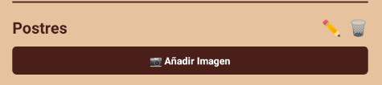
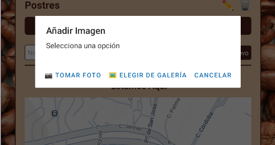
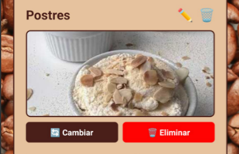
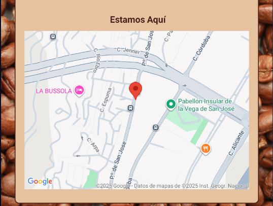

# Camper Café Native Expo

## Descripción del Proyecto

Aplicación móvil desarrollada con React Native y Expo, migrada desde una aplicación web React original. Permite gestionar un menú de cafetería con funcionalidades completas de CRUD (Crear, Leer, Actualizar, Eliminar) para categorías y productos. Incluye gestión de imágenes mediante cámara y galería, además de visualización de ubicación en mapa interactivo.

## Objetivo del Proyecto

Convertir una aplicación React web a React Native manteniendo la misma funcionalidad y diseño conceptual, adaptando la interfaz y el comportamiento al entorno móvil sin perder la estructura lógica del proyecto original. En esta versión actualizada se integran capacidades nativas de dispositivos móviles como cámara, galería de fotos y mapas.

## Tecnologías Utilizadas

⚛️ React Native - Framework para desarrollo móvil multiplataforma

⚡ Expo - Plataforma para desarrollo y despliegue de aplicaciones React Native

📘 TypeScript - Superset tipado de JavaScript

📸 Expo Image Picker - Selección de imágenes desde galería

📷 Expo Camera - Captura de fotos con la cámara del dispositivo

🗺️ React Native Maps - Integración de mapas interactivos

🧭 Expo Router - Sistema de navegación basado en archivos

🎨 StyleSheet API - Sistema de estilos de React Native

## Plataformas Soportadas

- **Web**: http://localhost
- **Android**: Dispositivos físicos y emuladores
- **iOS**: Dispositivos físicos y simuladores
- **Emuladores**: Android APK (Bluestacks / Expo Go)
- **Acceso remoto**: Mediante túneles de Expo

## Estructura del Proyecto

```
camper-cafe-native-expo/
├── app/
│   ├── _layout.tsx              # Layout global de la aplicación
│   ├── index.tsx                # Pantalla principal con CRUD y mapa
│   ├── modal.tsx                # Modal adicional
│   └── components/
│       └── menu/
│           ├── MenuItem.tsx     # Componente de producto individual
│           └── MenuSection.tsx  # Componente de categoría con imágenes
├── assets/
│   └── images/                  # Recursos e imágenes
├── screenshots/                 # Capturas de pantalla de la aplicación
├── constants/                   # Constantes de la aplicación
├── hooks/                       # Custom hooks
├── scripts/                     # Scripts de utilidad
├── app.json                     # Configuración de Expo
├── package.json                 # Dependencias del proyecto
└── README.md                    # Este archivo
```

## Instalación y Configuración

**1. Instalar Expo CLI globalmente**

```bash
# Instalar Expo CLI
npm install -g expo-cli
```

**2. Clonar el proyecto**

```bash
# Clonar el repositorio
git clone https://github.com/tu-usuario/camper-cafe-native-expo.git

# Entrar al directorio
cd camper-cafe-native-expo
```

**3. Instalar dependencias**

```bash
# Instalar todas las dependencias necesarias
npm install

# O con yarn
yarn install
```

**4. Iniciar el proyecto**

```bash
# Iniciar el servidor de desarrollo
npx expo start

# O usar scripts definidos
npm run android  # Para Android
npm run ios      # Para iOS
npm run web      # Para Web
```

**5. Ejecutar en dispositivo**

- Escanea el código QR con **Expo Go** (Android) o **Camera** (iOS)
- O presiona `a` para Android emulator / `i` para iOS simulator

## Características Principales

### Versión 2.0 (Actualizada)

- Gestión de imágenes para categorías
- Captura de fotos con la cámara del dispositivo
- Selección de imágenes desde galería
- Visualización de imágenes en formato base64
- Edición y eliminación de imágenes de categorías
- Mapa interactivo con ubicación de la cafetería
- Marker personalizado en el mapa
- Solicitud dinámica de permisos (cámara y galería)

### Versión 1.0 (Base)

- CRUD completo de categorías
- CRUD completo de productos
- Interfaz adaptada a móvil
- Navegación basada en archivos con Expo Router
- Conexión con API REST externa
- Diseño con imagen de fondo personalizada
- Estados de carga y manejo de errores

## Componentes Principales

### App.js

Componente raíz que configura la aplicación base y proporciona el contexto inicial.

### Index.tsx

Pantalla principal que gestiona toda la lógica de negocio:

- Implementa el CRUD completo de categorías y productos
- Gestiona estados con `useState`
- Carga datos desde API con `useEffect`
- Integra el mapa con la ubicación de la cafetería
- Coordenadas del café: **28.0916°N, 15.4190°W** (Las Palmas de Gran Canaria)

```typescript
// Ejemplo de implementación del mapa
const cafeLocation = {
  latitude: 28.0916,
  longitude: -15.419,
  latitudeDelta: 0.005,
  longitudeDelta: 0.005,
};

<MapView style={styles.map} initialRegion={cafeLocation}>
  <Marker
    coordinate={{
      latitude: cafeLocation.latitude,
      longitude: cafeLocation.longitude,
    }}
    title="Camper Café"
    description="Nuestra ubicación"
    pinColor="#4a1f1a"
  />
</MapView>;
```

### MenuSection.tsx

Gestiona cada categoría del menú con funcionalidades extendidas:

- Edición del nombre de la categoría
- Eliminación de categorías
- **Gestión completa de imágenes**:
  - Añadir imagen desde galería
  - Tomar foto con cámara
  - Cambiar imagen existente
  - Eliminar imagen
- Lista interactiva de productos
- Formulario para crear nuevos productos

```typescript
// Ejemplo de implementación del Image Picker
const pickImage = async (useCamera: boolean) => {
  try {
    let result;

    if (useCamera) {
      const permission = await ImagePicker.requestCameraPermissionsAsync();
      if (!permission.granted) {
        Alert.alert(
          "Permiso denegado",
          "Necesitas dar permiso para usar la cámara."
        );
        return;
      }
      result = await ImagePicker.launchCameraAsync({
        mediaTypes: ["images"],
        allowsEditing: true,
        aspect: [4, 3],
        quality: 0.5,
        base64: true,
      });
    } else {
      const permission =
        await ImagePicker.requestMediaLibraryPermissionsAsync();
      if (!permission.granted) {
        Alert.alert(
          "Permiso denegado",
          "Necesitas dar permiso para acceder a la galería."
        );
        return;
      }
      result = await ImagePicker.launchImageLibraryAsync({
        mediaTypes: ["images"],
        allowsEditing: true,
        aspect: [4, 3],
        quality: 0.5,
        base64: true,
      });
    }

    if (!result.canceled && result.assets[0].base64) {
      const base64Image = `data:image/jpeg;base64,${result.assets[0].base64}`;
      onUpdateCategory(category.id, category.name, base64Image);
      Alert.alert("Éxito", "Imagen añadida correctamente");
    }
  } catch (error) {
    Alert.alert("Error", "No se pudo seleccionar la imagen.");
  }
};
```

#### Flujo de uso de imágenes:

1. Usuario crea o edita una categoría
2. Presiona " Añadir Imagen"
3. Se muestra Alert con opciones: " Tomar Foto" o " Elegir de Galería"
4. El sistema solicita permisos si es necesario
5. Usuario selecciona/toma la imagen
6. La imagen se convierte a base64 y se muestra en la categoría
7. Puede cambiar o eliminar la imagen posteriormente

### MenuItem.tsx

Gestiona productos individuales:

- Vista normal: nombre, precio y botones de acción
- Vista de edición: campos editables
- Funcionalidades de guardar/cancelar cambios
- Eliminación de productos

### \_layout.tsx

Layout global que:

- Envuelve todas las pantallas con `<Slot />`
- Aplica imagen de fondo común a toda la app
- Define estilos base de la aplicación

## Migración de Estilos

Los estilos CSS tradicionales se migraron a `StyleSheet.create()`:

**Antes (CSS):**

```css
.panel {
  background: #fff;
  padding: 20px;
  border-radius: 10px;
}
```

**Después (React Native):**

```javascript
const styles = StyleSheet.create({
  panel: {
    backgroundColor: "#fff",
    padding: 20,
    borderRadius: 10,
  },
});
```

## Gestión de Permisos

La aplicación solicita permisos de forma dinámica cuando el usuario intenta usar las funcionalidades:

### Permisos de Cámara

```typescript
const permission = await ImagePicker.requestCameraPermissionsAsync();
if (!permission.granted) {
  Alert.alert("Permiso denegado", "Necesitas dar permiso para usar la cámara.");
  return;
}
```

### Permisos de Galería

```typescript
const permission = await ImagePicker.requestMediaLibraryPermissionsAsync();
if (!permission.granted) {
  Alert.alert(
    "Permiso denegado",
    "Necesitas dar permiso para acceder a la galería."
  );
  return;
}
```

## API Utilizada

**Endpoint base:**

```
https://jlorenzo.ddns.net/carta_restaurante
```

**Usuario ID:**

```
"4 ultimos digitos del dni"
```

### Endpoints disponibles:

**Obtener categorías:**

```
GET /categorias/?usuario_id=0110
```

**Crear categoría:**

```
POST /categorias/
Body: { "usuario_id": "0110", "nombre": "Nombre categoría" }
```

**Actualizar categoría:**

```
PUT /categorias/{id}
Body: { "usuario_id": "0110", "nombre": "Nuevo nombre" }
```

**Eliminar categoría:**

```
DELETE /categorias/{id}
Body: { "usuario_id": "0110" }
```

**Obtener productos de una categoría:**

```
GET /productos/{categoria_id}?usuario_id=0110
```

**Crear producto:**

```
POST /productos/{categoria_id}
Body: { "usuario_id": "0110", "nombre": "Producto", "precio": 10.50, "orden": 1 }
```

**Actualizar producto:**

```
PUT /productos/{id}
Body: { "usuario_id": "0110", "nombre": "Producto", "precio": 12.00 }
```

**Eliminar producto:**

```
DELETE /productos/{id}
Body: { "usuario_id": "0110" }
```

## Capturas de Pantalla

### Categoría sin imagen



_Botón para añadir imagen a una categoría_

### Menú de opciones de imagen



_Opciones para tomar foto o elegir de galería_

### Categoría con imagen



_Categoría con imagen añadida y opciones de cambiar/eliminar_

### Ubicación en mapa



_Mapa interactivo mostrando la ubicación de la cafetería_

## Funcionalidades por Versión

### Versión 2.0 - Nuevas Integraciones Nativas

| Funcionalidad         | Descripción                                  |
| --------------------- | -------------------------------------------- |
| Image Picker          | Selección de imágenes desde galería          |
| Camera                | Captura de fotos con cámara                  |
| Map View              | Visualización de ubicación en mapa           |
| Permisos dinámicos    | Solicitud de permisos en tiempo de ejecución |
| Almacenamiento base64 | Imágenes convertidas a base64                |
| Edición de imágenes   | Cambiar/eliminar imágenes de categorías      |

### Versión 1.0 - Funcionalidades Base

| Funcionalidad   | Descripción                                   |
| --------------- | --------------------------------------------- |
| CRUD Categorías | Crear, leer, actualizar y eliminar categorías |
| CRUD Productos  | Gestión completa de productos                 |
| Conexión API    | Integración con API REST externa              |
| Interfaz móvil  | Diseño adaptado a dispositivos móviles        |
| Navegación      | Sistema de routing con Expo Router            |

## Dependencias Principales

```json
{
  "dependencies": {
    "expo": "~54.0.23",
    "expo-image-picker": "~17.0.8",
    "expo-camera": "~17.0.9",
    "react-native-maps": "1.20.1",
    "expo-router": "~6.0.14",
    "react": "19.1.0",
    "react-native": "0.81.5"
  }
}
```

## Recursos de Referencia

Esta aplicación fue desarrollada siguiendo los tutoriales oficiales de Expo:

- [Expo Image Picker Documentation](https://docs.expo.dev/tutorial/image-picker/)
- [Expo Camera Documentation](https://docs.expo.dev/versions/latest/sdk/camera/)
- [React Native Maps Documentation](https://docs.expo.dev/versions/latest/sdk/map-view/)

## Autor

**Aridane Quevedo Cabrera**  
2º DAMN

## Historial de Cambios

### v2.0 - Noviembre 2025

- Integración de Expo Image Picker para galería
- Integración de Expo Camera para captura de fotos
- Implementación de React Native Maps
- Sistema de permisos dinámicos
- Gestión completa de imágenes en categorías (añadir, cambiar, eliminar)
- Conversión de imágenes a base64
- Mapa interactivo con ubicación de la cafetería
- Marker personalizado en el mapa
- Mejoras en la UI para gestión de imágenes

### v1.0 - Noviembre 2025

- Versión inicial del proyecto
- Migración de React Web a React Native
- CRUD completo de categorías y productos
- Integración con API REST
- Navegación con Expo Router
- Diseño responsivo para móviles
